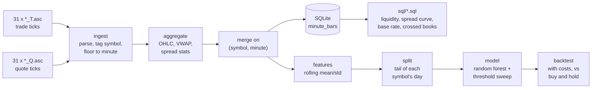

<h1 align="center">Minute-Level Price Direction on NSE Trade & Quote Data</h1>

<p align="center">
  One trading day of tick-level trade and quote records for 31 NIFTY names,<br/>
  aggregated to minute bars and used to ask whether the next minute is predictable.
</p>

<p align="center">
  <a href="https://github.com/VishnujanNarayanan/minute-level-stock-prediction/actions/workflows/ci.yml"></a>
  
  
  
  
  
</p>

---

## The result, up front

**There is no tradeable next-minute edge in this feature set on this day.**

```
threshold  trades  precision  base_rate  edge_over_base
     0.50    1026     0.4571     0.4684         -0.0113
     0.55     443     0.4357     0.4684         -0.0327
     0.60     146     0.4452     0.4684         -0.0232
     0.63      61     0.4590     0.4684         -0.0094
     0.65      32     0.5000     0.4684         +0.0316
     0.70      10     0.3000     0.4684         -0.1684

ROC-AUC 0.4937
```

Precision sits below the base rate at every cutoff but one, and that one fires on 32
trades. ROC-AUC below 0.5 means the ranking carries no information — buying at random
would have done as well.

The backtest agrees:

| | trades | gross | costs | net |
|---|---|---|---|---|
| no costs | 61 | −0.17 | 0.00 | **−0.17** |
| 10bp round trip | 61 | −0.17 | 12.20 | **−12.37** |
| buy and hold (3,100 bars) | — | — | — | **+4.81** |

It loses money *before* costs, and doing nothing beat it.

### Why an earlier version said otherwise

This repository previously reported **precision 0.6143 at threshold 0.63** and a profitable
backtest. Both were artefacts:

- The cutoff was chosen by sweeping thresholds **on the test set** and reporting the best
  one. On 70 trades that is noise, not an edge.
- The backtest charged **no transaction costs**, and its "profit" was smaller than the cost
  of the trades that generated it.

A backtest that lies is worse than no backtest. The tooling here is built so that this
particular lie is hard to tell again: `evaluate_at()` always returns precision beside the
base rate, an empty selection claims zero edge rather than 100% precision, and `run()`
charges costs and reports `survives_costs`.

---

## A real microstructure finding

The first query run against the warehouse returned a **negative** mean spread for the 09:00
hour. Not corrupt data — NSE runs a pre-open call auction from 09:00 to 09:15, and the book
is crossed by design during order collection while one opening price is discovered.

```
session              bars  crossed_bars  crossed_pct  mean_spread
continuous session  11637             0          0.0       0.8647
pre-open auction       31            31        100.0     -77.5158
```

Every pre-open bar is crossed; no continuous-session bar is. Averaging them together
poisons every spread statistic downstream, so `sql/crossed_book_minutes.sql` reports them
separately.

---

## Architecture



| module | responsibility |
|---|---|
| `ingest` | read the headerless per-symbol `.asc` files, tag each row with its symbol |
| `aggregate` | OHLC, volume, VWAP, spread statistics; the composite-key merge |
| `features` | rolling mean/std per symbol, the direction target, the leakage-safe column list |
| `split` | time-ordered holdout — the tail of each symbol's own day |
| `db` | SQLite warehouse; runs the files in `sql/` |
| `model` | training, the threshold sweep, precision against the base rate |
| `backtest` | costed simulation and the buy-and-hold benchmark |

---

## Two bugs the refactor found

**Every rolling window produced identical numbers.** The original built features in
`for window in [...]` loops whose lambdas closed over the loop variable — the late-binding
trap. Every window silently returned the last window's values.
`test_rolling_windows_do_not_all_collapse_to_the_last_one` pins it.

**An outlier could hide itself.** `wide_spread_minutes` compared each minute against an
average that included that minute, so a large enough blowout dragged its own baseline up
and escaped the filter. The baseline is now leave-one-out.

---

## Running it

```bash
pip install -r requirements-dev.txt

# the data is not in the repo (580MB of .asc feeds); point at wherever it lives
export NSE_TRADES_DIR=/path/to/trades
export NSE_QUOTES_DIR=/path/to/quotes

python -m nse_pipeline.build --db data/nse.db     # raw ticks -> warehouse
pytest                                            # 49 tests, no data required
jupyter notebook NSE_trade_quote.ipynb            # the narrative
```

With Docker:

```bash
docker compose run --rm tests                      # suite, no data needed
docker run --rm -v "$PWD/data:/data" nse-pipeline  # build the warehouse
```

---

## Scale

```
2,933,072 trade ticks
6,449,315 quote ticks
       31 NIFTY symbols, one session (2024-04-01)
   11,668 minute bars
       38 features
    8,537 train / 3,100 test
```

---

## Limitations

- **One trading day.** Every number here is in-sample on a single session. Nothing is
  validated out of sample, which is the main reason the negative result is stated as "no
  edge in this feature set on this day" rather than something stronger.
- **Top of book only.** The quote feed carries best bid and ask. Short-horizon signal
  usually lives in depth, which is not in this data.
- **Costs are a stand-in.** 10bp round trip approximates brokerage, STT, exchange fees, GST
  and stamp duty. It is not a broker's actual schedule.
- **No slippage or market impact.** Fills are assumed at the close of the signalling
  minute, which flatters any strategy.
- **The holdout is the end of the day.** The last 100 bars per symbol include the closing
  auction period, which does not behave like the rest of the session.

## What would make the question worth re-asking

- More than one session, so results can be checked out of sample.
- Order-book depth beyond level one.
- Choosing the cutoff on a validation split, never on the test set.

---

## License

MIT.

> Not financial advice, and explicitly not a validated trading strategy — the whole point
> of the writeup above is that it is not one.
